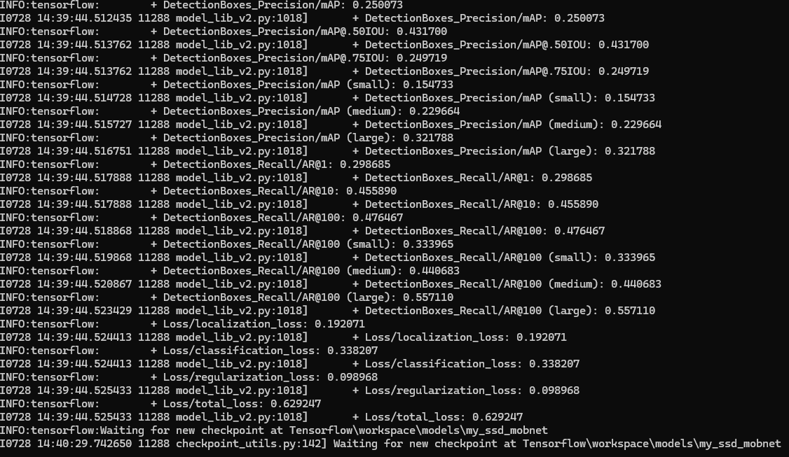

# Computer Vision Model for Object Detection for AROS 

 This project is designed to detect specific classes using a TensorFlow Lite model. 

 ## Classes detected 
- Obstacles
- person
- bicycle
- car
- motorcycle
- bus
- truck
- accident

## Metrics




## Sample of Real Time Detection

[Watch the video](https://drive.google.com/file/d/1eyrcY514wDC-7yBuJ6yC75GkH4GQ7QW3/view?usp=sharing)

## Steps

### Step 1: Generate TFLite Files
Walk through the TFOD tutorial up to step 12 to generate TFLite files.

### Step 2: Clone the Repository
Clone the current repository onto your Raspberry Pi or copy it from a machine using RDP.
```sh
git clone https://github.com/OmarZakaria10/Road-Obstacles-ObjectDetection-Tflite.git
```

### Step 3: Set Up Virtual Environment
Create and activate a virtual environment to manage project dependencies.

On Unix or MacOS:

```
python3 -m venv venv
source venv/bin/activate
```
On Windows:
```
python -m venv venv
venv\Scripts\activate
```

###Step 4: Install Dependencies
Install the required dependencies listed in the requirements.txt file

```
pip install -r requirements.txt
```

Additionally, install the following system dependencies on your Raspberry Pi:

```
sudo apt-get install libcblas-dev libhdf5-dev libhdf5-serial-dev libatlas-base-dev libjasper-dev libqtgui4 libqt4-test
echo "deb https://packages.cloud.google.com/apt coral-edgetpu-stable main" | sudo tee /etc/apt/sources.list.d/coral-edgetpu.list
curl https://packages.cloud.google.com/apt/doc/apt-key.gpg | sudo apt-key add -
sudo apt-get update
```

### Step 5: Run Real-Time Detections
```
python3 detect.py
```